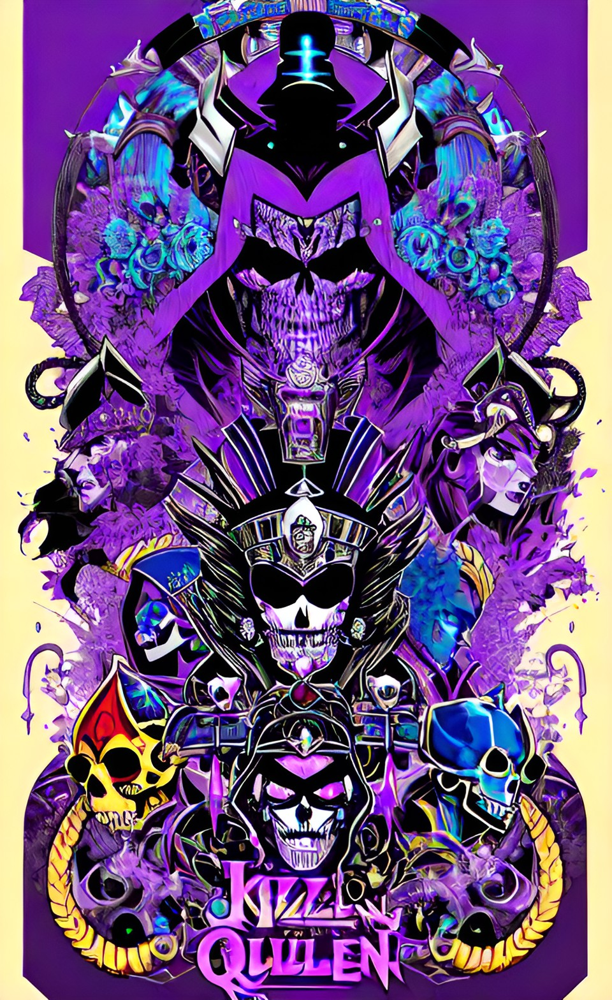
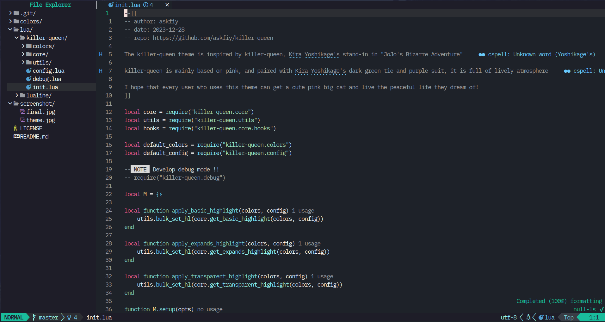

# README

<h3 align="center">
Neovim Killer Queen Theme
</h3>

<h6 align="center">

</h6>

<h6 align="center">
Enjoy a peaceful life
</h6>

<div style="font-size:.8rem; font-weight:lighter;color:#E95793">
<center>
<p>The killer-queen theme is inspired by killer-queen, Kira Yoshikage's stand-in in "JoJo's Bizarre Adventure".</p>
<p>killer-queen is mainly based on pink, and paired with Kira Yoshikage's dark green tie and purple suit, it is full of lively atmosphere.<p>
<p>I hope that every user who uses this theme can get a cute pink big cat and live the peaceful life they dream of!<p>
</center>
</div>

<h6 align="center">

</h6>

## Install and use

Install via `Lazy`:

```lua
-- lazy
{
    "askfiy/killer-queen",
    priority = 100,
    config = function()
        vim.cmd([[colorscheme killer-queen]])
    end,
},
```

## Default configuration

Default config, modify any option via `setup()`:

```lua
require("killer-queen").setup({
    -- Do you have some UI with borders?
    -- Such as completion menu, floating terminal, etc.? If none of them have a border, try setting it to false
    is_border = true,
    -- Whether to enable background transparency
    transparent = false,
    -- Whether to apply the adapted plugin
    expands = {
        lazy = true,
        aerial = true,
        nvim_cmp = true,
        gitsigns = true,
        which_key = true,
        nvim_tree = true,
        lspconfig = true,
        telescope = true,
        bufferline = true,
        treesitter = true,
        vim_illuminate = true,
    },
    hooks = {
        before = function(conf, colors, utils) end,
        after = function(conf, colors, utils) end,
    },
})
```

## Related functions

The plugin provides some utility functions:

```lua
require("killer-queen.utils")
   - set_hl(name, options)
   - bulk_set_hl(groups)
```

Example:

```lua
require("killer-queen.utils").set_hl("Normal", { fg = "#000000", bg = "#1E1E2E" })
require("killer-queen.utils").set_hl("Character", { link = "Constant" })
require("killer-queen.utils").bulk_set_hl({
    Normal = { fg = "#000000", bg = "#1E1E2E"},
    NormalFloat = { link = "Normal" },
    Cursor = { bg = "#0FE1EE", bold = true }
})
```

## Hooks function

The plugin provides 2 hook functions, which are automatically executed before and after the color is applied:

```lua
hooks = {
    before = function(conf, colors, utils) end,
    after = function(conf, colors, utils) end,
}
```

## Lualine integrated

This plugin integrates the `lualine` theme of the same name:

```lua
require("lualine").setup({
    options = {
        theme = "killer-queen"
    }
})
```

## Extension

Extended plugin colors are in the `expands` directory.

[lua/killer-queen/core/expands/](./lua/killer-queen/core/expands/)

Also, any new `PR`s are welcome, as I'm not enthusiastic about plugin adaptation, so may need everyone's help to make it better..

## License

This plugin is licensed under the MIT License. See the [LICENSE](https://github.com/askfiy/killer-queen/blob/master/LICENSE) file for details.

## Contributing

Contributions are welcome! If you encounter a bug or want to enhance this plugin, feel free to open an issue or create a pull request.

